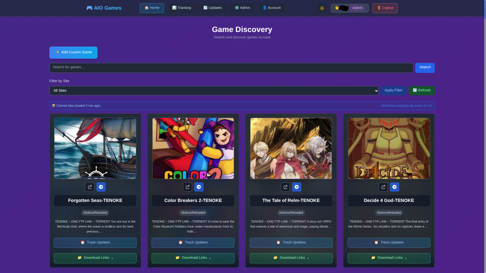
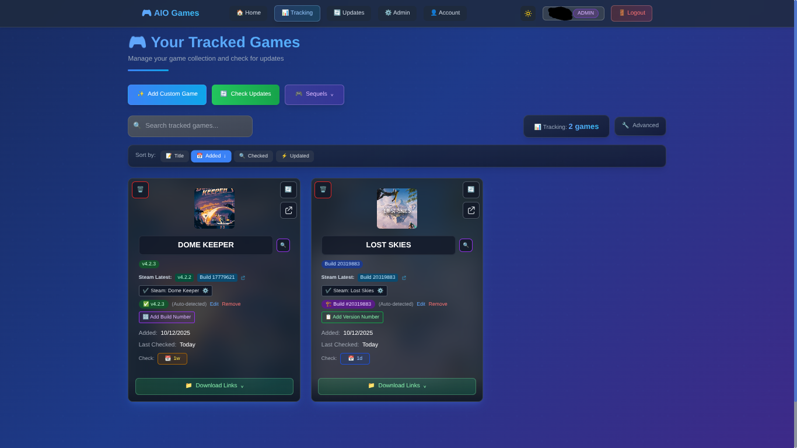
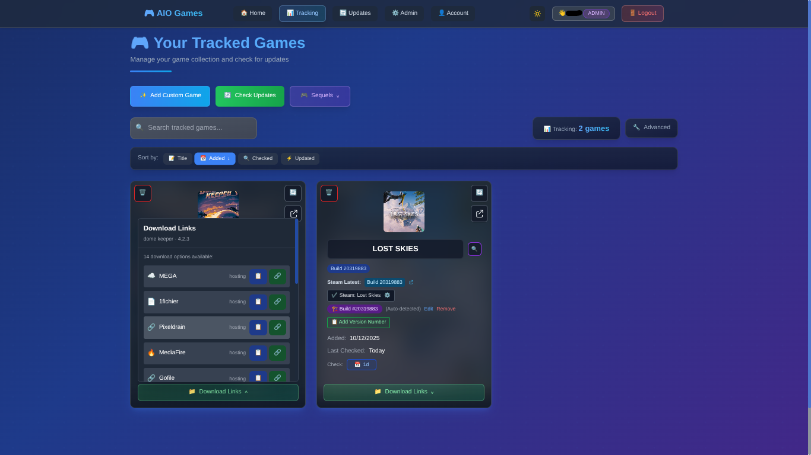
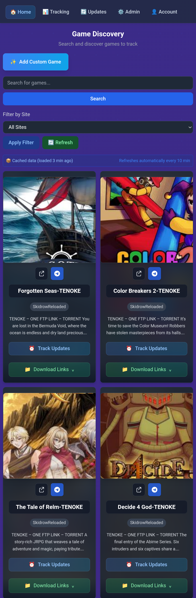
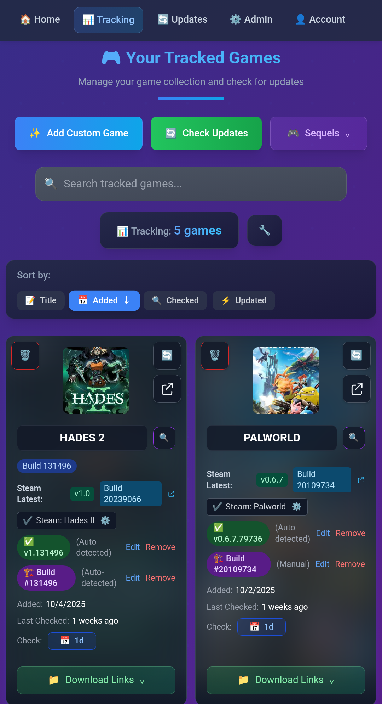
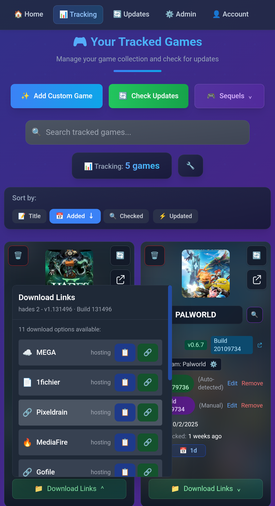

# 🎮 AIO-Games — Game Update Tracker

A self-hosted Next.js app that monitors game updates across 8+ sites, verifies versions against Steam and GOG, and sends instant Telegram/push notifications when new releases drop.

**[🌐 Live Demo](https://aiogames.iforgor.cc) | [📡 Game API](https://github.com/darkmaster420/gameapi)**

> The demo is for testing — self-host for reliable long-term use.

## 🖼️ Screenshots

| Platform | Home | Tracking | Downloads |
|----------|------|----------|-----------|
| **PC** |  |  |  |
| **Mobile** |  |  |  |

---

## ✨ Features (v2.0)

### Core
- **Multi-Site Monitoring** — GameDrive, SteamRip, SteamUnderground, SkidRow, FreeGOG, ReloadedSteam, Online-Fix, GOG-Games
- **Smart Version Detection** — Semantic versions, build numbers, date-based versions, scene group tags, and 50+ release format patterns
- **Automatic Update Scheduling** — Built-in background scheduler, per-game frequency, no cron jobs
- **Download Links** — One-click download link extraction with 30+ file host support (Mega, Mediafire, Pixeldrain, etc.)
- **Embedded Downloads** — GOG-Games torrent links available directly without extra fetch

### Verification & Matching
- **Steam Auto-Verification** — Automatic appid resolution with configurable confidence threshold
- **GOG Verification** — Link GOG product IDs, fetch version/build info from GOGDB
- **SteamDB Monitoring** — Real-time RSS-based Steam update tracking with build number comparison
- **IGDB Integration** — Twitch/IGDB metadata lookup for cover art, genres, and release dates
- **Roman Numeral Search** — Searches both "Schedule 1" and "Schedule I" to find Steam listings
- **Sequel & DLC Detection** — Automatically identifies numbered sequels, expansions, remasters, and definitive editions

### Notifications & Approval
- **Telegram Notifications** — Instant alerts with game images via a shared bot
- **Web Push Notifications** — Browser notifications via service worker
- **Admin Approval System** — Vote-based multi-admin approval for pending updates via Telegram
- **Auto-Approval** — Configurable threshold for automatic update approval when version confidence is high

### Management
- **Owner/Admin/User Roles** — Role-based permissions with ban/unban and user management
- **Per-Game Pages** — `/appid/{id}` detail pages with Steam data, version history, and download links
- **Title Cleaning** — Strips scene tags, platform indicators, and release group names for clean display
- **AI-Powered Analysis** — Optional AI integration for intelligent title analysis and update detection

### Deployment
- **Docker Ready** — Production and development compose files with MongoDB
- **Electron Desktop App** — Standalone Windows app with auto-updater from GitHub releases
- **Cloudflare Workers** — Game API and Steam API proxy deploy to the edge

---

## 🚀 Quick Start

### Prerequisites
- Node.js 18+
- MongoDB instance (or use the Docker compose)
- Deployed [gameapi](https://github.com/darkmaster420/gameapi) instance

### Docker (Recommended)

```bash
git clone https://github.com/darkmaster420/AIOgames.git
cd AIOgames

# Configure .env (see Environment section below)

docker compose -f docker-compose.production.yml up -d
```

### Local Development

```bash
npm install
cp .env.example .env.local
# Edit .env.local with your settings
npm run dev
```

---

## ⚙️ Environment Variables

```env
# Required
MONGODB_URI=mongodb://localhost:27017/aiogames
NEXTAUTH_URL=http://localhost:3000
NEXTAUTH_SECRET=your-secret-key
GAME_API_URL=https://your-gameapi-instance.workers.dev

# Owner Account (auto-created at startup)
OWNER_EMAIL=admin@example.com
OWNER_PASSWORD=secure-password-here
OWNER_NAME=Admin

# Optional — Steam
STEAM_API_KEY=your-steam-api-key

# Optional — Telegram
TELEGRAM_BOT_TOKEN=your-bot-token-from-botfather

# Optional — Push Notifications (auto-generated on first run)
NEXT_PUBLIC_VAPID_PUBLIC_KEY=your-vapid-key
VAPID_PRIVATE_KEY=your-vapid-private-key
```

---

## 📡 Supported Sites

| Site | Type | Notes |
|------|------|-------|
| GameDrive | WordPress API | — |
| SteamRip | WordPress API | FlareSolverr recommended |
| SteamUnderground | WordPress API | — |
| SkidRow Reloaded | WordPress API | Circuit-breaker protected |
| FreeGOG PC Games | WordPress API | — |
| ReloadedSteam | WordPress API | — |
| Online-Fix | Custom scraper | — |
| GOG-Games | JSON API | Includes embedded torrent links |

---

## 👑 Roles & Permissions

| Feature | Owner | Admin | User |
|---------|-------|-------|------|
| Track & manage games | ✅ | ✅ | ✅ |
| View updates & downloads | ✅ | ✅ | ✅ |
| Configure notifications | ✅ | ✅ | ✅ |
| Approve/deny updates | ✅ | ✅ | — |
| Ban/unban users | ✅ | ✅ | — |
| Promote to admin | ✅ | — | — |

The owner account is auto-created from environment variables at startup.

---

## 📲 Telegram Setup

1. Create a bot via [@BotFather](https://t.me/botfather) → set `TELEGRAM_BOT_TOKEN`
2. Set webhook: `https://api.telegram.org/bot<TOKEN>/setWebhook?url=https://your-domain.com/api/telegram/webhook`
3. Users send `/start` to the bot to get their Chat ID
4. Enter Chat ID or `@username` in `/user/manage` settings

Admin commands: `/approve <key>`, `/deny <key>`, `/help`

---

## 🛠️ Tech Stack

| Layer | Technology |
|-------|-----------|
| Frontend | Next.js 15, React 19, TypeScript, Tailwind CSS |
| Backend | Next.js API Routes, MongoDB/Mongoose, NextAuth.js |
| External | [Game API](https://github.com/darkmaster420/gameapi) (Cloudflare Workers), SteamDB RSS, Steam Web API, IGDB/Twitch API, GOGDB |
| Desktop | Electron with auto-updater |
| Infrastructure | Docker, Docker Compose |

---

## 📊 API Endpoints

| Endpoint | Description |
|----------|-------------|
| `GET /api/games/recent` | Recent uploads across all sites |
| `GET /api/games/{appid}` | Game details by Steam appid |
| `GET /api/games/downloads` | Download links for tracked games |
| `GET /api/games/links` | Download links by postId + siteType |
| `GET /api/tracking` | List tracked games |
| `POST /api/tracking` | Track a game |
| `POST /api/updates/check` | Check all tracked games for updates |
| `POST /api/updates/check-single` | Check a single game |
| `POST /api/updates/approve` | Approve a pending update |
| `GET /api/steam` | Steam search and SteamDB data proxy |
| `GET /api/steamdb` | SteamDB RSS update feed |
| `GET /api/gogdb` | GOG database queries |
| `GET /api/scheduler` | Background scheduler status |

---

## 🐳 Docker

```bash
# Production
docker compose -f docker-compose.production.yml up -d

# Development (hot reload)
docker compose -f docker-compose.development.yml up -d

# Logs
docker compose -f docker-compose.production.yml logs -f
```

---

## 📖 Documentation

See [docs/README.md](docs/README.md) for detailed guides:
- Docker deployment
- AI worker setup
- Steam API migration
- GOG priority integration
- Game tracking internals

---

## ❓ FAQ

**Is this legal?**
AIOgames only aggregates publicly available information. It does not download or distribute games. Use your own judgment and visit external sites with a VPN and adblocker.

**Do I need my own gameapi instance?**
Yes. Self-deployment keeps the project free, decentralized, and private. Setup takes minutes on Cloudflare Workers.

**How often does it check for updates?**
Configurable per game — from 1 hour to 1 month. The background scheduler runs automatically.

**Does it download games?**
No. It's a notification and tracking system only. You download manually from your preferred source.

**Do I need a Steam API key?**
Optional. Steam integration improves tracking accuracy but everything works without it. SteamDB monitoring uses public RSS feeds.

---

## ☑️ To-Do

- [x] Search across all sites from home page
- [x] Per-game detail pages (`/appid/{id}`)
- [x] Telegram admin approval system
- [x] GOG verification and version tracking
- [x] SteamDB real-time monitoring
- [x] Auto-approval with configurable threshold
- [x] Sequel and DLC detection
- [x] Electron desktop app
- [x] Embedded download links for GOG-Games
- [ ] Email notifications
- [ ] Custom themes
- [ ] Merge GameAPI into AIOGames

---

## 🔗 Related Projects

- **[gameapi](https://github.com/darkmaster420/gameapi)** — Cloudflare Workers API powering game search (required)
- **[Pixeldrain Limit Bypass](https://pdbypass.iforgor.cc)** — Cloudflare Workers proxy to bypass Pixeldrain limits
- **[Game Search](https://github.com/darkmaster420/gamesearch)** — The original prototype that evolved into AIOgames

---

## 🤝 Contributing

1. Fork the repo
2. Deploy [gameapi](https://github.com/darkmaster420/gameapi) and configure `.env`
3. Create a feature branch
4. Test with both Steam-verified and non-verified games
5. Open a Pull Request

---

## 📄 License

MIT — see [LICENSE](LICENSE)

---

*AIOgames v2.0 — Built for the gaming community*
