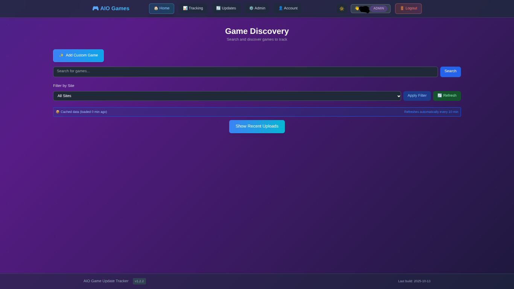
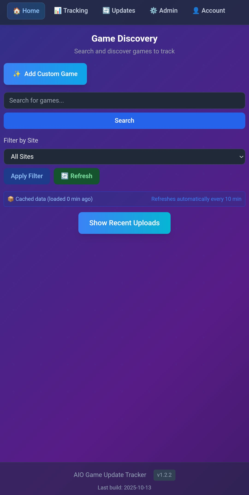

# 🎮 AIO-Games - Advanced Game Update Tracker

## 🖼️ Screenshots

| Platform | Home (No Posts) | Home (With Posts) | Tracking Page | Tracking Page (DL Options) |
|----------|-----------------|-------------------|---------------|---------------------------|
| **PC**   |  |  |  |  |
| **Mobile** |  |  |  |  |

---

## 📖 Documentation

All guides and advanced docs are now in the [docs/README.md](docs/README.md) documentation hub. See there for:
- Production deployment
- Docker setup
- Scheduler details
- AI/Steam integration
- Game tracking and more

---

A powerful Next.js application that automatically tracks game updates across multiple sites with intelligent Steam integration and real-time notifications.

**[🌐 Live Demo](https://aiogames.iforgor.cc) | [📚 Game API](https://github.com/darkmaster420/gameapi)**

> **Note**: The demo site is frequently updated and may be unstable. For reliable use, self-hosting is recommended.

---

## 🎯 Why AIOgames?

Gamers who sail the high seas don't get automated update notifications like legitimate platform users do. The existing options are frustrating:
- 📡 **RSS feeds** - Need to manage multiple feeds and parse them manually
- 💬 **Forums** - Constantly checking threads for update announcements  
- 🌐 **Site browsing** - Juggling between 20+ different sites to find updates
- 📝 **Manual tracking** - Keeping notes on which version you have

**AIOgames solves this.** It automatically monitors all major sources, intelligently tracks versions, and notifies you the moment an update drops. No more hunting across the internet - if it's online, you'll find it here.

---


## ✨ Latest Features (v1.3.0)

- 👑 **Owner/Admin System**: Role-based permissions with user management
- 🤖 **Telegram Admin Approval**: Multi-admin vote-based update approval system
- 📱 **Shared Telegram Bot**: Simplified notification setup for all users
- 🔨 **Ban System**: Admin-level user ban/unban with reason tracking
- 🎮 **SteamDB Integration**: Real-time Steam update detection with RSS feeds
- ⚠️ **Version Cross-Checking**: Smart comparison between tracked and Steam versions  
- 🔍 **Steam Verification**: Enhanced game matching with Steam API integration
- 🤖 **AI-Powered Detection**: Intelligent game update recognition
- 📱 **Mobile-Optimized UI**: Responsive design with advanced controls
- 🔄 **Single Game Updates**: Per-game update checking with SteamDB cross-reference
- 🏗️ **Build Number Tracking**: Precise version tracking with SteamDB build numbers

---

## ❓ FAQ

### Is this legal?
Using AIOgames is completely legal - it only gathers information from publicly available sources on the internet. However, you should visit external game sites carefully, ideally with a VPN and adblocker. I'm not a lawyer and don't provide legal advice, so use your own judgment.

### How often does it check for updates?
It's completely configurable per game. You can set update checks anywhere from **1 hour to 1 month** depending on how actively a game is being updated. New releases might warrant hourly checks, while stable games can be checked weekly or monthly.

### Do I need to deploy my own gameapi instance?
**Yes.** If I gave everyone access to my Cloudflare Workers instance, it would cost me money once traffic scales up. Requiring self-deployment keeps the project:
- ✅ **Free** - No costs for anyone
- ✅ **Decentralized** - No single point of failure
- ✅ **Private** - Your searches and data stay on your infrastructure

Setting up your own gameapi instance is straightforward and covered in the setup instructions.

### Can I use the demo site instead of self-hosting?
You *can*, but **I wouldn't recommend it**. The demo site is:
- ⚠️ Updated very frequently and can break
- ⚠️ Not guaranteed to be stable or available
- ⚠️ May have rate limits or restrictions

**Self-hosting is completely free** and gives you full control. It's the better option for reliable, long-term use.

### What game sites does AIOgames support?
AIOgames monitors all major sources including GameDrive, SteamRip, SkidRow, FreeGog, and more. The full list is maintained in the [gameapi repository](https://github.com/darkmaster420/gameapi). It also integrates with **SteamDB** for real-time Steam update feeds.

### Does it automatically download games?
**No.** AIOgames only tracks and notifies you about updates. You still need to manually download games from your preferred sources. Think of it as a notification system, not an automation tool.

### How does Steam integration work?
AIOgames can verify games against Steam's database for enhanced accuracy. It also monitors **SteamDB RSS feeds** for real-time Steam updates and cross-references them with your tracked versions to warn you when you're behind.

### Do I need a Steam API key?
**No, it's optional.** Steam integration enhances tracking accuracy but isn't required. SteamDB integration works without any API keys since it uses public RSS feeds.

---

## 🌟 Core Features

- 🔍 **Multi-Site Tracking**: Monitors GameDrive, SteamRip, SkidRow, FreeGog and more
- 🤖 **Automatic Scheduling**: Built-in update checker - no cron jobs needed
- 🏴‍☠️ **Smart Piracy Tag Handling**: Handles 50+ scene groups and release formats
- ⚡ **Lightning Fast**: Sub-second update checks
- 🎯 **Intelligent Matching**: Version-aware updates with confidence scoring
- 📱 **Real-time Notifications**: Telegram and web push notifications
- 👑 **Role-Based Access**: Owner/Admin system with user management
- 🤖 **Telegram Admin Approval**: Vote-based pending update approval system
- 🔐 **Secure Authentication**: NextAuth.js with multiple providers
- 🌙 **Dark Mode**: Beautiful UI with light/dark theme support
- 🐳 **Container Ready**: Docker deployment with zero external dependencies

## 🏗️ Required Repositories

AIOgames depends on additional repositories to function properly:

### 📡 Game API Service
**Repository**: [darkmaster420/gameapi](https://github.com/darkmaster420/gameapi)

This Cloudflare Workers-based API provides:
- Game search across multiple piracy sites
- Unified data aggregation and normalization
- Rate limiting and caching for optimal performance
- Cross-origin resource sharing (CORS) support

**Setup Instructions**:
1. Clone the gameapi repository
2. Deploy to Cloudflare Workers
3. Update your `GAME_API_URL` environment variable
cd gameapi
npm install
npm run deploy

### 🔗 API Integration
The Game API handles:
### Option 1: Docker Deployment (Recommended)
```bash
# 1. Setup Game API first (see above)

# 2. Clone AIOgames
git clone https://github.com/darkmaster420/AIOgames.git
cd AIOgames

# 3. Copy and configure environment
# Edit .env with your Game API URL and other settings

# 4. Start with Docker Compose
docker compose -f docker-compose.production.yml up -d
# 1. Ensure Game API is deployed and accessible
# 2. Install dependencies
npm install

# 3. Configure environment
cp .env.example .env.local
# Set GAME_API_URL to your deployed gameapi instance

# 4. Start development server
npm run dev
```


## ⚙️ Environment Configuration

Required environment variables:

```env
# Database
MONGODB_URI=mongodb://localhost:27017/aiogames

# Authentication
NEXTAUTH_URL=http://localhost:3000
NEXTAUTH_SECRET=your-secret-key

# Owner Account (Created at startup)
OWNER_EMAIL=admin@example.com
OWNER_PASSWORD=secure-password-here
OWNER_NAME=Admin

# Game API (Required)
GAME_API_URL=https://your-gameapi-instance.workers.dev
# Get this from your deployed gameapi repository

# Steam Integration (Optional - for enhanced features)
STEAM_API_KEY=your-steam-api-key
# Get from: https://steamcommunity.com/dev/apikey

# Push Notifications (Optional)
NEXT_PUBLIC_VAPID_PUBLIC_KEY=your-vapid-key
VAPID_PRIVATE_KEY=your-vapid-private-key

# Telegram Bot (Optional - for admin approval and notifications)
TELEGRAM_BOT_TOKEN=your-bot-token-from-botfather
# Get from @BotFather on Telegram

# SteamDB Integration (Automatic)
# No configuration needed - uses public RSS feeds
```


### 🔑 API Keys Guide

1. **Game API URL**: Deploy the [gameapi repository](https://github.com/darkmaster420/gameapi) to Cloudflare Workers
2. **Steam API Key**: Optional, but enables Steam verification features
3. **VAPID Keys**: Auto-generated on first run for push notifications
4. **Telegram Bot Token**: Optional, enables admin approval system and user notifications

---

## 👑 Owner & Admin System

AIOgames includes a powerful role-based permission system:

### 🔐 Roles & Permissions

#### Owner (Super Admin)
The owner account is automatically created at startup from environment variables:
- ✅ **Full System Control**: Complete access to all features
- ✅ **User Management**: Create, ban, and unban users
- ✅ **Role Assignment**: Promote users to admin or demote to regular user
- ✅ **Protected Status**: Cannot be banned or demoted
- ✅ **Auto-Verified Email**: Email automatically verified at creation

#### Admin
Admins can be promoted by the owner:
- ✅ **Game Management**: Full access to game tracking and updates
- ✅ **Update Approval**: Approve/deny pending updates via Telegram
- ✅ **Ban Users**: Can ban and unban regular users
- ⛔ **Cannot**: Affect owner account or promote to admin

#### User (Default)
Regular users have standard access:
- ✅ **Track Games**: Add and manage their own tracked games
- ✅ **View Updates**: See approved game updates
- ✅ **Notifications**: Configure Telegram and push notifications
- ⛔ **Cannot**: Access admin features or ban other users

### 🚀 Setting Up the Owner Account

1. **Configure Environment Variables**:
```env
OWNER_EMAIL=admin@example.com
OWNER_PASSWORD=YourSecurePassword123
OWNER_NAME=Site Administrator
```

2. **Start the Application**:
```bash
docker compose -f docker-compose.production.yml up -d
# OR for development
npm run dev
```

3. **Owner Account Created**:
   - Account is automatically created/updated at startup
   - Email is auto-verified
   - Can immediately log in with the configured credentials

4. **Manage Users**:
   - Go to `/admin` dashboard (owner/admin only)
   - View all users
   - Promote users to admin
   - Ban/unban users with reason tracking

---

## 📲 Telegram Bot Setup & Admin Approval

AIOgames uses a **shared Telegram bot** for admin notifications and pending update approvals.

### 🤖 Why a Shared Bot?

Instead of users creating their own bots:
- ✅ **Simpler Setup**: Users just provide their username or Chat ID
- ✅ **Admin Approval System**: Pending updates sent to all admins automatically
- ✅ **Centralized Management**: One bot handles all notifications
- ✅ **Vote-Based Approval**: Requires 50% admin consensus

### 🔧 Setting Up the Telegram Bot

#### Step 1: Create the Bot

1. **Message @BotFather** on Telegram
2. **Create a new bot**: `/newbot`
3. **Set bot name**: `AIOgames Notifications` (or your choice)
4. **Set username**: `YourAIOgamesBot` (must end in 'bot')
5. **Copy the bot token**: You'll get something like `1234567890:ABCdefGHIjklMNOpqrsTUVwxyz`

#### Step 2: Configure the Bot

Add the bot token to your environment:

```env
TELEGRAM_BOT_TOKEN=1234567890:ABCdefGHIjklMNOpqrsTUVwxyz
```

#### Step 3: Set Up Webhook (Production)

**⚠️ Note**: The webhook endpoint `/api/telegram/webhook` is **public** (no authentication required) as Telegram servers need to access it. This is standard for Telegram bot webhooks.

For the bot to receive messages, set up a webhook using any of these methods:

**Method 1: Using cURL (Recommended)**
```bash
curl -X POST "https://api.telegram.org/bot<YOUR_BOT_TOKEN>/setWebhook" \
  -H "Content-Type: application/json" \
  -d '{"url": "https://your-domain.com/api/telegram/webhook"}'
```

**Method 2: Using Browser (Simple)**

Just visit this URL in your browser (replace the placeholders):
```
https://api.telegram.org/bot<YOUR_BOT_TOKEN>/setWebhook?url=https://your-domain.com/api/telegram/webhook
```

**Method 3: Using GET Request**
```bash
curl "https://api.telegram.org/bot<YOUR_BOT_TOKEN>/setWebhook?url=https://your-domain.com/api/telegram/webhook"
```

**Replace:**
- `<YOUR_BOT_TOKEN>` with your actual bot token
- `https://your-domain.com` with your production domain

**Verify Webhook is Set:**
```bash
curl "https://api.telegram.org/bot<YOUR_BOT_TOKEN>/getWebhookInfo"
```

**Remove Webhook (if needed):**
```bash
curl "https://api.telegram.org/bot<YOUR_BOT_TOKEN>/deleteWebhook"
```

#### Step 4: Enable Telegram for Admins

1. **Log in as Owner/Admin**
2. **Go to** `/user/manage`
3. **Enable Telegram Notifications**
4. **Start the bot** on Telegram
5. **Send `/start`** to get your Chat ID
6. **Enter your username** (e.g., `@yourusername`) or Chat ID
7. **Save settings**

### ⚖️ Admin Approval System

When a new game update is detected:

1. **📨 Automatic Notification**: All admins with Telegram enabled receive a message
2. **🎯 Inline Buttons**: Click "✅ Approve" or "❌ Deny"
3. **🗳️ Vote Tracking**: System tracks who voted for what
4. **✔️ Auto-Apply**: Update is applied when 50% of admins approve
5. **📝 Text Commands**: Also supports `/approve <key>` and `/deny <key>` commands

#### Example Approval Message:
```
🎮 New Update Pending Approval

Game: Resident Evil 4
Version: v20240115-TENOKE
Source: GameDrive

Approve this update?

[✅ Approve] [❌ Deny]

Approvals: 0/2 (2 admins total)
```

#### Commands:
- `/start` - Get your Chat ID and welcome message
- `/approve <key>` - Approve a pending update
- `/deny <key>` - Deny a pending update
- `/help` - Show available commands

### � Webhook Security

The webhook endpoint is **public by design** (Telegram servers need to access it), but includes built-in security:

- ✅ **User Validation**: Only processes messages from users who have configured Telegram in their account
- ✅ **Role-Based Access**: Admin-only commands (approve/deny) check user role before executing
- ✅ **Bot Token Verification**: Only responds if `TELEGRAM_BOT_TOKEN` is configured
- ✅ **Database Integration**: All actions require valid user records in database
- ⚠️ **Best Practice**: Use a strong, unique bot token from BotFather
- 💡 **Optional**: You can add rate limiting or IP filtering at your reverse proxy/firewall level

**Note**: This is the standard security model for Telegram webhooks - authentication happens through the bot token and user database validation, not through HTTP authentication.

### �👤 User Telegram Notifications

Regular users can also receive notifications:

1. **Enable Telegram** in `/user/manage`
2. **Start the shared bot** on Telegram
3. **Send `/start`** to get Chat ID
4. **Enter username or Chat ID** in settings
5. **Receive instant notifications** when tracked games update

---

## 📖 How It Works

### 🎯 Smart Game Tracking Process

1. **🔍 Search & Add**: Find games using the integrated search powered by the Game API
2. **🔐 Steam Verification**: Optionally verify games with Steam for enhanced tracking
3. **📊 Multi-Source Monitoring**: 
   - Traditional site scraping via Game API
   - Real-time SteamDB RSS feed monitoring
   - Cross-reference between tracked and Steam versions
4. **🤖 Automatic Updates**: Background scheduler checks for updates based on your frequency settings
5. **⚠️ Smart Alerts**: Get notified about:
   - New game releases
   - Version updates with precise build numbers
   - When your tracked version falls behind Steam
6. **📱 Instant Notifications**: Receive updates via web push notifications (Telegram coming soon)

### 🎮 SteamDB Integration

AIOgames now includes advanced Steam integration:

- **📡 Real-time RSS Monitoring**: Direct feeds from SteamDB for instant Steam updates
- **🔢 Build Number Tracking**: Precise version comparison using Steam build numbers
- **⚠️ Version Cross-Checking**: Warns when your tracked version is behind Steam
- **🎯 Steam-Verified Games**: Enhanced accuracy for Steam-verified titles
- **🔄 Per-Game Checks**: Individual game update checks include SteamDB data

### 🤖 AI-Powered Features

- **🧠 Intelligent Version Detection**: Recognizes version patterns across different formats
- **🎯 Smart Game Matching**: AI-assisted game identification and deduplication  
- **📊 Confidence Scoring**: Rates update reliability for better decision making
- **🔍 Sequel Detection**: Automatically identifies game sequels and expansions

## 🔧 Production Features

### Automatic Update Scheduling
- ✅ **Zero Configuration**: Internal scheduler handles everything
- ✅ **Per-Game Frequency**: Choose hourly, daily, weekly, or manual checking
- ✅ **Smart Resource Usage**: Only checks when updates are due
- ✅ **Real-time Status**: Monitor automatic update schedule from dashboard

### Advanced Game Matching
- ✅ **Scene Group Detection**: Recognizes CODEX, EMPRESS, FitGirl, DODI, etc.
- ✅ **Version Intelligence**: Semantic version comparison with build numbers
- ✅ **Steam Integration**: Enhanced matching using Steam API
- ✅ **Cross-Site Coverage**: Updates tracked across all supported sites

### Robust Notifications
-- ✅ **Telegram Notifications**: Get update alerts via Telegram (coming soon)
- ✅ **Web Push Notifications**: Browser notifications with service worker
- ✅ **Update History**: Complete tracking of all game updates
- ✅ **Sequel Detection**: Automatically detect game sequels and expansions

## 📊 API Endpoints

### Game Tracking
- `GET /api/tracking` - Get tracked games with SteamDB integration
- `POST /api/tracking` - Add game to tracking
- `DELETE /api/tracking` - Remove tracked game

### Update Management
- `POST /api/updates/check` - Manual update check across all sources
- `POST /api/updates/check-single` - Check specific game (includes SteamDB)
- `GET /api/scheduler` - View automatic update status

### SteamDB Integration
- `GET /api/steamdb?action=updates` - Get Steam updates for all tracked games
- `GET /api/steamdb?action=updates&appId={id}` - Get updates for specific Steam app
- `GET /api/steamdb?action=notifications` - Get formatted Steam update notifications

### Game Management
- `POST /api/games/steam-verify` - Verify game with Steam API
- `POST /api/games/version-verify` - Manual version/build number verification
- `GET /api/games/recent` - Get recently updated games
- `GET /api/games/search` - Search games via Game API

### Authentication
- `POST /api/auth/register` - User registration
- Standard NextAuth.js endpoints for authentication

### Notifications
- `GET /api/notifications` - Get user notifications

- `GET /api/notifications/vapid-public` - Get VAPID public key

## 🐳 Docker Deployment

### Production Setup

```bash
# Production deployment
docker compose -f docker-compose.production.yml up -d

# View logs
docker compose -f docker-compose.production.yml logs -f

# Stop services
docker compose -f docker-compose.production.yml down
```

### Development Setup

```bash
# Development with hot reload
docker compose -f docker-compose.development.yml up -d
```

## 🛠️ Tech Stack

### Frontend
- **Next.js 15** with App Router and Turbopack
- **React 19** with latest features and optimizations
- **TypeScript** for type safety and better DX
- **Tailwind CSS** for responsive, modern styling
- **Service Workers** for offline support and push notifications

### Backend
- **Next.js API Routes** with TypeScript
- **MongoDB** with Mongoose ODM
- **NextAuth.js** for secure authentication
- **Background Schedulers** for automatic update checking

### External Services
- **[Game API](https://github.com/darkmaster420/gameapi)** - Cloudflare Workers for game data
- **SteamDB RSS** - Real-time Steam update feeds
- **Steam Web API** - Game verification and metadata
-- **Telegram Notifications** - Get update alerts via Telegram (coming soon)

### Infrastructure
- **Docker** with multi-stage builds for production
- **Docker Compose** for development and deployment
- **MongoDB** containerized database
- **Environment-based configuration** for different deployments

### Development Tools
- **ESLint** with TypeScript rules
- **Prettier** for code formatting
- **Husky** for git hooks
- **TypeScript strict mode** for maximum type safety

## 📱 Browser Support

- ✅ Chrome/Edge 88+
- ✅ Firefox 78+  
- ✅ Safari 14+
- ✅ Mobile browsers with service worker support

## 🔒 Security

- Server-side authentication with NextAuth.js
- Environment variable protection
- CORS configuration for external API access
- Secure cookie handling
- XSS protection with proper content security policies

## 📈 Performance

- Sub-second update checks using optimized algorithms
- Efficient database queries with MongoDB aggregation
- Client-side caching with React hooks
- Optimized Docker images with multi-stage builds
- Background processing for automatic updates

## 🤝 Contributing

We welcome contributions! Here's how to get started:

1. **Fork the repository**
2. **Set up dependencies**:
   - Deploy [gameapi](https://github.com/darkmaster420/gameapi) first
   - Configure your environment variables
3. **Create your feature branch** (`git checkout -b feature/amazing-feature`)
4. **Test thoroughly** with both traditional and Steam-verified games
5. **Commit your changes** (`git commit -m 'Add amazing feature'`)
6. **Push to the branch** (`git push origin feature/amazing-feature`)
7. **Open a Pull Request**

### 🧪 Testing Guidelines

- Test with both Steam-verified and non-verified games
- Verify SteamDB integration works correctly
- Check mobile responsiveness
-- Test Telegram notification functionality (coming soon)

## 📄 License

This project is licensed under the MIT License - see the [LICENSE](LICENSE) file for details.


## 🔗 Related Projects

All of these projects are open source and free to use:

### Core Dependencies
- **[gameapi](https://github.com/darkmaster420/gameapi)** - Cloudflare Workers API that powers game search and data aggregation (Required)

### Other Tools by darkmaster420
- **[Pixeldrain Limit Bypass](https://pdbypass.iforgor.cc)** - Cloudflare Workers proxy to bypass Pixeldrain's download limits and restrictions
- **[Game Search](https://github.com/darkmaster420/gamesearch)** - Simple game search interface that started it all - the original prototype that evolved into AIOgames

---

## 🆘 Support & Links

- **🐛 Bug Reports**: [Create an Issue](https://github.com/darkmaster420/AIOgames/issues)
- **💡 Feature Requests**: [Discussions](https://github.com/darkmaster420/AIOgames/discussions)
- **📚 Game API**: [darkmaster420/gameapi](https://github.com/darkmaster420/gameapi)
- **📖 Documentation**: Check the wiki for detailed setup guides

---

## ☑️ To-Do

- [x] Anonymous user search functions
- [ ] Email Notifications
- [ ] Telegram Bot Management
- [ ] Merge GameAPI with AIOGames
- [ ] Add Custom themes
- [x] Approve updates via telegram
- [ ] big update 2.0 add game pages and rework how games are shown by appid using /appid/ route and using APIs to build pages and show results using one truth game post and taking users to game pages to track games and view posts

---

**🎯 Built with ❤️ for the gaming community**

*AIOgames v1.x.x - Now with Telegram admin approval and role-based permissions*
