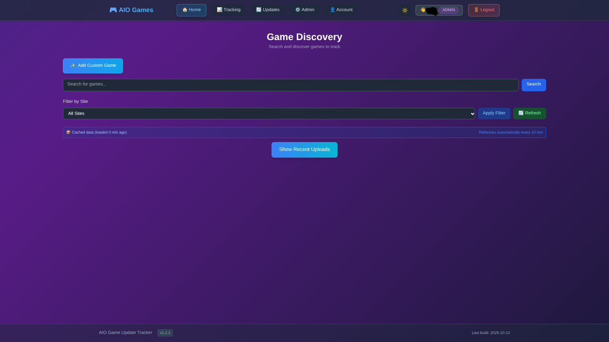

# 🎮 AIO-Games - Advanced Game Update Tracker

## 🖼️ Screenshots

| Platform | Home (No Posts) | Home (With Posts) | Tracking Page | Tracking Page (DL Options) |
|----------|-----------------|-------------------|---------------|---------------------------|
| **PC**   |  |  |  |  |
| **Mobile** |  |  |  |  |

---

## 📖 Documentation

All guides and advanced docs are now in the [docs/README.md](docs/README.md) documentation hub. See there for:
- Production deployment
- Docker setup
- Scheduler details
- AI/Steam integration
- Game tracking and more

---

A powerful Next.js application that automatically tracks game updates across multiple sites with intelligent Steam integration and real-time notifications.

**[🌐 Live Demo](https://aiogames.iforgor.cc) | [📚 Game API](https://github.com/darkmaster420/gameapi)**

> **Note**: The demo site is frequently updated and may be unstable. For reliable use, self-hosting is recommended.

---

## 🎯 Why AIOgames?

Gamers who sail the high seas don't get automated update notifications like legitimate platform users do. The existing options are frustrating:
- 📡 **RSS feeds** - Need to manage multiple feeds and parse them manually
- 💬 **Forums** - Constantly checking threads for update announcements  
- 🌐 **Site browsing** - Juggling between 20+ different sites to find updates
- 📝 **Manual tracking** - Keeping notes on which version you have

**AIOgames solves this.** It automatically monitors all major sources, intelligently tracks versions, and notifies you the moment an update drops. No more hunting across the internet - if it's online, you'll find it here.

---


## ✨ Latest Features (v1.2.2)

- 🎮 **SteamDB Integration**: Real-time Steam update detection with RSS feeds
- ⚠️ **Version Cross-Checking**: Smart comparison between tracked and Steam versions  
- 🔍 **Steam Verification**: Enhanced game matching with Steam API integration
- 🤖 **AI-Powered Detection**: Intelligent game update recognition
- 📱 **Mobile-Optimized UI**: Responsive design with advanced controls
- 🔄 **Single Game Updates**: Per-game update checking with SteamDB cross-reference
- 🏗️ **Build Number Tracking**: Precise version tracking with SteamDB build numbers
- 📲 **Telegram Notifications**: Get update alerts via Telegram

---

## ❓ FAQ

### Is this legal?
Using AIOgames is completely legal - it only gathers information from publicly available sources on the internet. However, you should visit external game sites carefully, ideally with a VPN and adblocker. I'm not a lawyer and don't provide legal advice, so use your own judgment.

### How often does it check for updates?
It's completely configurable per game. You can set update checks anywhere from **1 hour to 1 month** depending on how actively a game is being updated. New releases might warrant hourly checks, while stable games can be checked weekly or monthly.

### Do I need to deploy my own gameapi instance?
**Yes.** If I gave everyone access to my Cloudflare Workers instance, it would cost me money once traffic scales up. Requiring self-deployment keeps the project:
- ✅ **Free** - No costs for anyone
- ✅ **Decentralized** - No single point of failure
- ✅ **Private** - Your searches and data stay on your infrastructure

Setting up your own gameapi instance is straightforward and covered in the setup instructions.

### Can I use the demo site instead of self-hosting?
You *can*, but **I wouldn't recommend it**. The demo site is:
- ⚠️ Updated very frequently and can break
- ⚠️ Not guaranteed to be stable or available
- ⚠️ May have rate limits or restrictions

**Self-hosting is completely free** and gives you full control. It's the better option for reliable, long-term use.

### What game sites does AIOgames support?
AIOgames monitors all major sources including GameDrive, SteamRip, SkidRow, FreeGog, and more. The full list is maintained in the [gameapi repository](https://github.com/darkmaster420/gameapi). It also integrates with **SteamDB** for real-time Steam update feeds.

### Does it automatically download games?
**No.** AIOgames only tracks and notifies you about updates. You still need to manually download games from your preferred sources. Think of it as a notification system, not an automation tool.

### How does Steam integration work?
AIOgames can verify games against Steam's database for enhanced accuracy. It also monitors **SteamDB RSS feeds** for real-time Steam updates and cross-references them with your tracked versions to warn you when you're behind.

### Do I need a Steam API key?
**No, it's optional.** Steam integration enhances tracking accuracy but isn't required. SteamDB integration works without any API keys since it uses public RSS feeds.

---

## 🌟 Core Features

- 🔍 **Multi-Site Tracking**: Monitors GameDrive, SteamRip, SkidRow, FreeGog and more
- 🤖 **Automatic Scheduling**: Built-in update checker - no cron jobs needed
- 🏴‍☠️ **Smart Piracy Tag Handling**: Handles 50+ scene groups and release formats
- ⚡ **Lightning Fast**: Sub-second update checks
- 🎯 **Intelligent Matching**: Version-aware updates with confidence scoring
- 📱 **Real-time Notifications**: Telegram and web push notifications
- 🔐 **Secure Authentication**: NextAuth.js with multiple providers
- 🌙 **Dark Mode**: Beautiful UI with light/dark theme support
- 🐳 **Container Ready**: Docker deployment with zero external dependencies

## 🏗️ Required Repositories

AIOgames depends on additional repositories to function properly:

### 📡 Game API Service
**Repository**: [darkmaster420/gameapi](https://github.com/darkmaster420/gameapi)

This Cloudflare Workers-based API provides:
- Game search across multiple piracy sites
- Unified data aggregation and normalization
- Rate limiting and caching for optimal performance
- Cross-origin resource sharing (CORS) support

**Setup Instructions**:
1. Clone the gameapi repository
2. Deploy to Cloudflare Workers
3. Update your `GAME_API_URL` environment variable
cd gameapi
npm install
npm run deploy

### 🔗 API Integration
The Game API handles:
### Option 1: Docker Deployment (Recommended)
```bash
# 1. Setup Game API first (see above)

# 2. Clone AIOgames
git clone https://github.com/darkmaster420/AIOgames.git
cd AIOgames

# 3. Copy and configure environment
# Edit .env with your Game API URL and other settings

# 4. Start with Docker Compose
docker compose -f docker-compose.production.yml up -d
# 1. Ensure Game API is deployed and accessible
# 2. Install dependencies
npm install

# 3. Configure environment
cp .env.example .env.local
# Set GAME_API_URL to your deployed gameapi instance

# 4. Start development server
npm run dev
```


## ⚙️ Environment Configuration

Required environment variables:

```env
# Database
MONGODB_URI=mongodb://localhost:27017/aiogames

# Authentication
NEXTAUTH_URL=http://localhost:3000
NEXTAUTH_SECRET=your-secret-key

# Game API (Required)
GAME_API_URL=https://your-gameapi-instance.workers.dev
# Get this from your deployed gameapi repository

# Steam Integration (Optional - for enhanced features)
STEAM_API_KEY=your-steam-api-key
# Get from: https://steamcommunity.com/dev/apikey

# Push Notifications (Optional)
NEXT_PUBLIC_VAPID_PUBLIC_KEY=your-vapid-key
VAPID_PRIVATE_KEY=your-vapid-private-key

# Telegram Notifications (coming soon)
# TELEGRAM_WEBHOOK_TOKEN=your-webhook-verification-token

# SteamDB Integration (Automatic)
# No configuration needed - uses public RSS feeds
```


### 🔑 API Keys Guide

1. **Game API URL**: Deploy the [gameapi repository](https://github.com/darkmaster420/gameapi) to Cloudflare Workers
2. **Steam API Key**: Optional, but enables Steam verification features
3. **VAPID Keys**: Auto-generated on first run for push notifications


## 📲 Telegram Notifications (coming soon)

Get update alerts via Telegram as soon as new game updates are detected. Setup and management will be available in a future release.

## 📖 How It Works

### 🎯 Smart Game Tracking Process

1. **🔍 Search & Add**: Find games using the integrated search powered by the Game API
2. **🔐 Steam Verification**: Optionally verify games with Steam for enhanced tracking
3. **📊 Multi-Source Monitoring**: 
   - Traditional site scraping via Game API
   - Real-time SteamDB RSS feed monitoring
   - Cross-reference between tracked and Steam versions
4. **🤖 Automatic Updates**: Background scheduler checks for updates based on your frequency settings
5. **⚠️ Smart Alerts**: Get notified about:
   - New game releases
   - Version updates with precise build numbers
   - When your tracked version falls behind Steam
6. **📱 Instant Notifications**: Receive updates via web push notifications (Telegram coming soon)

### 🎮 SteamDB Integration

AIOgames now includes advanced Steam integration:

- **📡 Real-time RSS Monitoring**: Direct feeds from SteamDB for instant Steam updates
- **🔢 Build Number Tracking**: Precise version comparison using Steam build numbers
- **⚠️ Version Cross-Checking**: Warns when your tracked version is behind Steam
- **🎯 Steam-Verified Games**: Enhanced accuracy for Steam-verified titles
- **🔄 Per-Game Checks**: Individual game update checks include SteamDB data

### 🤖 AI-Powered Features

- **🧠 Intelligent Version Detection**: Recognizes version patterns across different formats
- **🎯 Smart Game Matching**: AI-assisted game identification and deduplication  
- **📊 Confidence Scoring**: Rates update reliability for better decision making
- **🔍 Sequel Detection**: Automatically identifies game sequels and expansions

## 🔧 Production Features

### Automatic Update Scheduling
- ✅ **Zero Configuration**: Internal scheduler handles everything
- ✅ **Per-Game Frequency**: Choose hourly, daily, weekly, or manual checking
- ✅ **Smart Resource Usage**: Only checks when updates are due
- ✅ **Real-time Status**: Monitor automatic update schedule from dashboard

### Advanced Game Matching
- ✅ **Scene Group Detection**: Recognizes CODEX, EMPRESS, FitGirl, DODI, etc.
- ✅ **Version Intelligence**: Semantic version comparison with build numbers
- ✅ **Steam Integration**: Enhanced matching using Steam API
- ✅ **Cross-Site Coverage**: Updates tracked across all supported sites

### Robust Notifications
-- ✅ **Telegram Notifications**: Get update alerts via Telegram (coming soon)
- ✅ **Web Push Notifications**: Browser notifications with service worker
- ✅ **Update History**: Complete tracking of all game updates
- ✅ **Sequel Detection**: Automatically detect game sequels and expansions

## 📊 API Endpoints

### Game Tracking
- `GET /api/tracking` - Get tracked games with SteamDB integration
- `POST /api/tracking` - Add game to tracking
- `DELETE /api/tracking` - Remove tracked game

### Update Management
- `POST /api/updates/check` - Manual update check across all sources
- `POST /api/updates/check-single` - Check specific game (includes SteamDB)
- `GET /api/scheduler` - View automatic update status

### SteamDB Integration
- `GET /api/steamdb?action=updates` - Get Steam updates for all tracked games
- `GET /api/steamdb?action=updates&appId={id}` - Get updates for specific Steam app
- `GET /api/steamdb?action=notifications` - Get formatted Steam update notifications

### Game Management
- `POST /api/games/steam-verify` - Verify game with Steam API
- `POST /api/games/version-verify` - Manual version/build number verification
- `GET /api/games/recent` - Get recently updated games
- `GET /api/games/search` - Search games via Game API

### Authentication
- `POST /api/auth/register` - User registration
- Standard NextAuth.js endpoints for authentication

### Notifications
- `GET /api/notifications` - Get user notifications

- `GET /api/notifications/vapid-public` - Get VAPID public key

## 🐳 Docker Deployment

### Production Setup

```bash
# Production deployment
docker compose -f docker-compose.production.yml up -d

# View logs
docker compose -f docker-compose.production.yml logs -f

# Stop services
docker compose -f docker-compose.production.yml down
```

### Development Setup

```bash
# Development with hot reload
docker compose -f docker-compose.development.yml up -d
```

## 🛠️ Tech Stack

### Frontend
- **Next.js 15** with App Router and Turbopack
- **React 19** with latest features and optimizations
- **TypeScript** for type safety and better DX
- **Tailwind CSS** for responsive, modern styling
- **Service Workers** for offline support and push notifications

### Backend
- **Next.js API Routes** with TypeScript
- **MongoDB** with Mongoose ODM
- **NextAuth.js** for secure authentication
- **Background Schedulers** for automatic update checking

### External Services
- **[Game API](https://github.com/darkmaster420/gameapi)** - Cloudflare Workers for game data
- **SteamDB RSS** - Real-time Steam update feeds
- **Steam Web API** - Game verification and metadata
-- **Telegram Notifications** - Get update alerts via Telegram (coming soon)

### Infrastructure
- **Docker** with multi-stage builds for production
- **Docker Compose** for development and deployment
- **MongoDB** containerized database
- **Environment-based configuration** for different deployments

### Development Tools
- **ESLint** with TypeScript rules
- **Prettier** for code formatting
- **Husky** for git hooks
- **TypeScript strict mode** for maximum type safety

## 📱 Browser Support

- ✅ Chrome/Edge 88+
- ✅ Firefox 78+  
- ✅ Safari 14+
- ✅ Mobile browsers with service worker support

## 🔒 Security

- Server-side authentication with NextAuth.js
- Environment variable protection
- CORS configuration for external API access
- Secure cookie handling
- XSS protection with proper content security policies

## 📈 Performance

- Sub-second update checks using optimized algorithms
- Efficient database queries with MongoDB aggregation
- Client-side caching with React hooks
- Optimized Docker images with multi-stage builds
- Background processing for automatic updates

## 🤝 Contributing

We welcome contributions! Here's how to get started:

1. **Fork the repository**
2. **Set up dependencies**:
   - Deploy [gameapi](https://github.com/darkmaster420/gameapi) first
   - Configure your environment variables
3. **Create your feature branch** (`git checkout -b feature/amazing-feature`)
4. **Test thoroughly** with both traditional and Steam-verified games
5. **Commit your changes** (`git commit -m 'Add amazing feature'`)
6. **Push to the branch** (`git push origin feature/amazing-feature`)
7. **Open a Pull Request**

### 🧪 Testing Guidelines

- Test with both Steam-verified and non-verified games
- Verify SteamDB integration works correctly
- Check mobile responsiveness
-- Test Telegram notification functionality (coming soon)

## 📄 License

This project is licensed under the MIT License - see the [LICENSE](LICENSE) file for details.


## 🔗 Related Projects

All of these projects are open source and free to use:

### Core Dependencies
- **[gameapi](https://github.com/darkmaster420/gameapi)** - Cloudflare Workers API that powers game search and data aggregation (Required)

### Other Tools by darkmaster420
- **[Pixeldrain Limit Bypass](https://pdbypass.iforgor.cc)** - Cloudflare Workers proxy to bypass Pixeldrain's download limits and restrictions
- **[Game Search](https://github.com/darkmaster420/gamesearch)** - Simple game search interface that started it all - the original prototype that evolved into AIOgames

---

## 🆘 Support & Links

- **🐛 Bug Reports**: [Create an Issue](https://github.com/darkmaster420/AIOgames/issues)
- **💡 Feature Requests**: [Discussions](https://github.com/darkmaster420/AIOgames/discussions)
- **📚 Game API**: [darkmaster420/gameapi](https://github.com/darkmaster420/gameapi)
- **📖 Documentation**: Check the wiki for detailed setup guides

---

## ☑️ To-Do

- [ ] User configurable flaresolverr/GameAPI
- [ ] Anonymous user search functions
- [ ] Email Notifications
- [ ] Telegram Bot Management
- [x] Anti-Repack Settings
- [ ] Merge GameAPI with AIOGames
- [ ] Flaresolverrless GameAPI 
- [ ] Add Custom themes

---

** 🎯 Built with ❤️ for the gaming community**

*AIOgames v1.3.x - Now with advanced Steam integration and real-time update detection*
